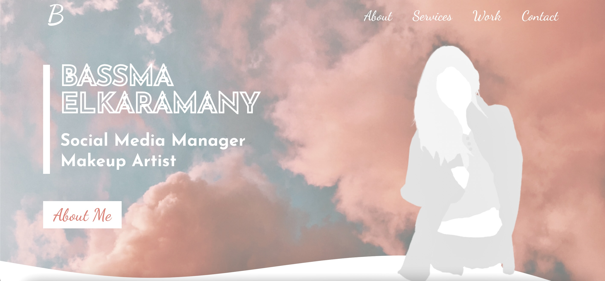
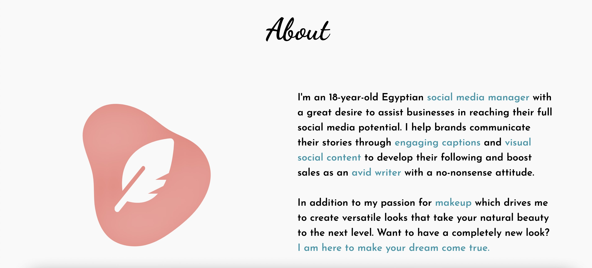
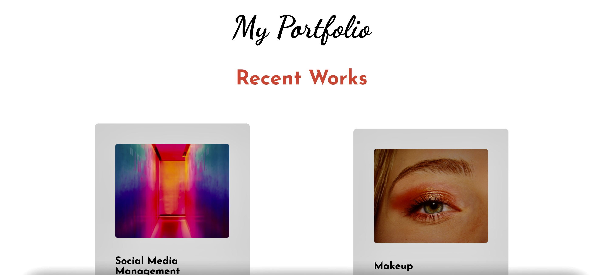
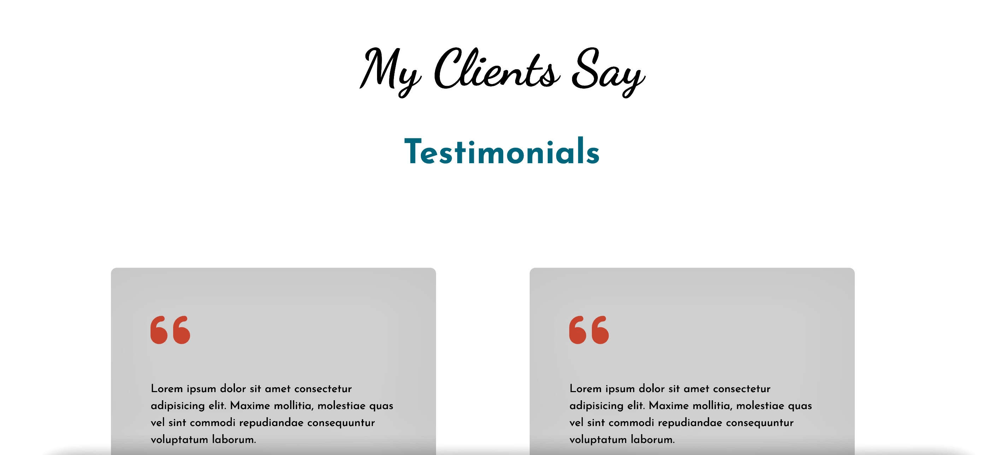
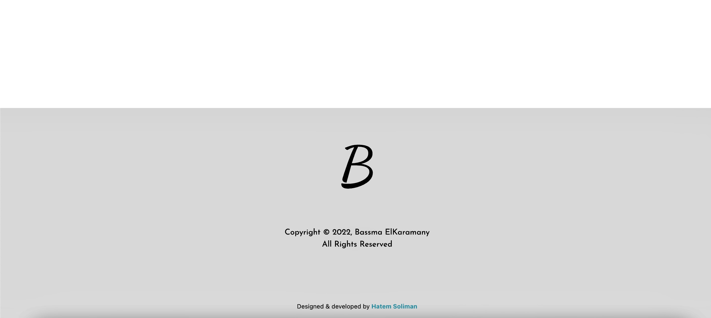

# Project Title

Social Media Manager & Make Up Artist Portfolio

## Description

Portfolio for a client that wants to showcase her skills on the Internet

## Preview







## Getting Started

### Dependencies

* CSS
* React.js
* JSX
* Swiper.js
* Fontawesome

### Installing

* Clone repo using HTTPS or download manually
* Open in VSCode

### Executing program

```
install npm
```
```
npm start
```

## Help

Any advise for common problems or issues.
```
command to run if program contains helper info
```

## Authors

Contributors names and contact info

ex. Hatem   
ex. [@codenkoffee](https://www.instagram.com/codenkoffee/)

## Version History

* 0.2
    * Various bug fixes and optimizations
    * See [commit change]() or See [release history]()
* 0.1
    * Initial Release

## License

This is intellectual property